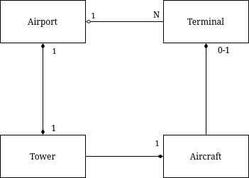

# Se familiariser avec l'existant

## A- Exécution

Compilez et lancez le programme.

Allez dans le fichier `tower_sim.cpp` et recherchez la fonction responsable de gérer les inputs du programme.
Sur quelle touche faut-il appuyer pour ajouter un avion ?
Comment faire pour quitter le programme ?
A quoi sert la touche 'F' ?

> Il faut utiliser la touche 'C' pour ajouter un avion. 
> 
> Pour quitter le programme, il faut utiliser la touche 'Q'.
> 
> La touche 'F' permet d'entrer et sortir du mode plein écran.

Ajoutez un avion à la simulation et attendez.
Que est le comportement de l'avion ?
Quelles informations s'affichent dans la console ?

> L'avion atterrit, les passagers transitent puis l'avion redécolle.
> 
> La console fournit toujours les informations avec l'immatriculation de l'avion,
  elle indique lorsqu'un avion atterrit, commence à décharger les passagers, termine le déchargement et
  lorsqu'il redécolle.

Ajoutez maintenant quatre avions d'un coup dans la simulation.
Que fait chacun des avions ?

> Les avions atterrissent (puis déchargent leurs passagers) quand la piste est libre et si elle n'est pas libre, ils tournent
  dans l'espace aérien autour de l'aéroport.

## B- Analyse du code

Listez les classes du programme à la racine du dossier src/.
Pour chacune d'entre elle, expliquez ce qu'elle représente et son rôle dans le programme.

Pour les classes `Tower`, `Aircaft`, `Airport` et `Terminal`, listez leurs fonctions-membre publiques et expliquez précisément à quoi elles servent.
Réalisez ensuite un schéma présentant comment ces différentes classes intéragissent ensemble.

> Aircraft:
> - La classe représente un avion et permet de manipuler ceux-ci
> - ``get_flight_num``: getter qui renvoie l'immatriculation de l'avion
> - ``distance_to``: calcule la distance de l'avion par rapport à un point
> - ``display``: affiche l'afion
> - ``move``: déplace l'avion vers son prochain waypoint pour une frame
> 
> AircraftType:
> - La structure représente un modèle d'avion (vitesse au sol, en l'air, accélération max, texture)
> 
> Airport:
> - La classe représente un aéroport
> - ``get_tower``: renvoie la tour de l'aéroport
> - ``display``: affiche l'aéroport
> - ``move``: fais avancer le service de tous les terminaux de l'aéroport
> 
> AirportType:
> - La classe représente un type d'aéroport (position des terminaux, piste d'atterrissage)
> 
> Point2D:
> - Représente un point dans un espace en 2 dimensions
> 
> Runway:
> - Représente une piste d'atterrissage (à l'aide de ses coordonnées relatives à l'aéroport)
> 
> Terminal:
> - Représente un terminal de l'aéroport qui permet aux avions de décharger leurs passagers
> - ``in_use``: renvoie si un avion est en train d'utiliser le terminal
> - ``is_servicing``: renvoie si le terminal a terminé le déchargement de l'avion actuel
> - ``assign_craft``: assigne un avion au terminal
> - ``finish_service``: termine le servicing si le terminal a terminé ses cycles de service
> - ``move``: fait avancer le service du terminal
> 
> Tower:
> - Représente une tour qui permet de savoir sur quel terminal se trouve un avion, permet aux avions de recevoir des
> instructions et de demander un terminal
> - ``get_circle``: renvoie la liste de waypoints permettant de faire le tour de l'espace aérien de l'aéroport
> - ``find_craft_and_terminal``: trouve sur quel terminal se trouve un avion s'il est sur l'un d'eux
> - ``arrived_at_terminal``: assigne un avion a un terminal
> - ``get_instructions``: détermine les instructions à suivre pour un avion
> 
> TowerSimulation:
> - Représente l'objet qui contrôle le programme de simulation d'aéroport
> 
> Waypoint:
> - Représente un point sur l'itinéraire d'un avion

Quelles classes et fonctions sont impliquées dans la génération du chemin d'un avion ?

> Afin de créer un avion, la classe ``TowerSim`` utilise sa méthode ``create_random_aircraft`` qui elle même appelle la
> méthode ``create_aircraft`` de la même classe avec des paramètres aléatoires. Cette méthode utilise des Point3D afin
> de représenter la position et la vitesse de l'avion.

Quel conteneur de la librairie standard a été choisi pour représenter le chemin ?
Expliquez les intérêts de ce choix.

> Les points de passage sont stockés dans une deque. On peut ainsi ajouter un point à la fin de la deque et en retirer
> en tête. On peut donc ajouter des points sans modifier le chemin courant de l'avion et l'ordre est conservé.

## C- Bidouillons !

1) Déterminez à quel endroit du code sont définies les vitesses maximales et accélération de chaque avion.
Le Concorde est censé pouvoir voler plus vite que les autres avions.
Modifiez le programme pour tenir compte de cela.

2) Identifiez quelle variable contrôle le framerate de la simulation.\
Le framerate correspond au temps de rafraichissement du programme, c'est-à-dire le nombre de fois où les éléments du programme seront mis à jour (ajout de nouvel avion à la simulation, déplacement, etc) en une seconde.\
Ajoutez deux nouveaux inputs au programme permettant d'augmenter ou de diminuer cette valeur.
Essayez maintenant de mettre en paused le programme en manipulant ce framerate. Que se passe-t-il ?\
Ajoutez une nouvelle fonctionnalité au programme pour mettre le programme en paused, et qui ne passe pas par le framerate.

> Le nombre de framerate devient très élevé si on essaie de diminuer trop bas.

3) Identifiez quelle variable contrôle le temps de débarquement des avions et doublez-le.

> Dans le fichier config.hpp le champ SERVICE_CYCLES.

4) Lorsqu'un avion a décollé, il réattérit peu de temps après.
Assurez-vous qu'à la place, il soit supprimé de la `move_queue`.\
Pour tester, il suffit de dézoomer et de vérifier que les avions suffisament éloignés ne bougent plus.
Indices :\
A quel endroit pouvez-vous savoir que l'avion doit être supprimé ?\
Pourquoi n'est-il pas sûr de procéder au retrait de l'avion dans cette fonction ?
A quel endroit de la callstack pourriez-vous le faire à la place ?\
Que devez-vous modifier pour transmettre l'information de la première à la seconde fonction ?

> On peut savoir que l'avion doit être supprimé dans la méthode get_instructions de la classe Tower. Il n'est pas sûr
> de retirer l'avion dans cette fonction car, il faut en même temps le retirer de la move_queue,
> auquel cas celle-ci accédera à des objets qui n'existent plus, ce qui lèvera une exception. On peut donc retirer
> l'avion dans la méthode timer de la classe opengl_interface, car on parcours la move_queue dans cette fonction.
> On va retirer l'avion de la liste d'éléments à déplacer ici. Pour transmettre l'information, on crée une fonction
> bool must_remove() classe DynamicObject. Si elle renvoie true, l'objet est supprimé et l'implémentation par défaut 
> renvoie true. Ainsi dans aicraft.cpp on return true uniquement si l'avion a été servi et qu'il n'a pas de prochain 
> waypoint.

5) Lorsqu'un objet de type `Displayable` est créé, il faut ajouter celui-ci manuellement dans la liste des objets à afficher.
Il faut également penser à le supprimer de cette liste avant de le détruire.
Faites en sorte que l'ajout et la suppression de `display_queue` soit "automatiquement gérée" lorsqu'un `Displayable` est créé ou détruit.\
Essayez maintenant de supprimer complètement l'avion du programme lorsque vous le retirez de la `move_queue`.\
En dézoomant, vous devriez maintenant constater que les avions disparaissent maintenant de l'écran.

> On ajoute l'objet à la queue dans son constructeur, et on sauvegarde son indice dans la queue. Dans le desctructeur,
on supprime l'objet de la queue à l'aide de son indice.

6) La tour de contrôle a besoin de stocker pour tout `Aircraft` le `Terminal` qui lui est actuellement attribué, afin de pouvoir le libérer une fois que l'avion décolle.
Cette information est actuellement enregistrée dans un `std::vector<std::pair<const Aircraft*, size_t>>` (size_t représentant l'indice du terminal).
Cela fait que la recherche du terminal associé à un avion est réalisée en temps linéaire, par rapport au nombre total de terminaux.
Cela n'est pas grave tant que ce nombre est petit, mais pour préparer l'avenir, on aimerait bien remplacer le vector par un conteneur qui garantira des opérations efficaces, même s'il y a beaucoup de terminaux.\
Modifiez le code afin d'utiliser un conteneur STL plus adapté. Normalement, à la fin, la fonction `find_craft_and_terminal(const Aicraft&)` ne devrait plus être nécessaire.

> Afin d'accéder à l'indice du terminal avec une complexité en O(1), on utilise une map de ``Aicraft`` vers size_t.

## D- Théorie

1) Comment a-t-on fait pour que seule la classe `Tower` puisse réserver un terminal de l'aéroport ?

> La map est privée, ainsi seule la classe tower peut y accéder.

2) En regardant le contenu de la fonction `void Aircraft::turn(Point3D direction)`, pourquoi selon-vous ne sommes-nous pas passer par une réference constante ?
Pourquoi n'est-il pas possible d'éviter la copie du `Point3D` passé en paramètre ?

> On ne peut pas passer par une référence constance car, la méthode cap_length fait des mutations sur le point.
Car sinon on modifierait le prochain waypoint de l'avion.

## E- Bonus

Le temps qui s'écoule dans la simulation dépend du framerate du programme.
La fonction move() n'utilise pas le vrai temps. Faites en sorte que si.
Par conséquent, lorsque vous augmentez le framerate, la simulation s'exécute plus rapidement, et si vous le diminuez, celle-ci s'exécute plus lentement.

Dans la plupart des jeux ou logiciels que vous utilisez, lorsque le framerate diminue, vous ne le ressentez quasiment pas (en tout cas, tant que celui-ci ne diminue pas trop).
Pour avoir ce type de résultat, les fonctions d'update prennent généralement en paramètre le temps qui s'est écoulé depuis la dernière frame, et l'utilise pour calculer le mouvement des entités.

Recherchez sur Internet comment obtenir le temps courant en C++ et arrangez-vous pour calculer le dt (delta time) qui s'écoule entre deux frames.
Lorsque le programme tourne bien, celui-ci devrait être quasiment égale à 1/framerate.
Cependant, si le programme se met à ramer et que la callback de glutTimerFunc est appelée en retard (oui oui, c'est possible), alors votre dt devrait être supérieur à 1/framerate.

Passez ensuite cette valeur à la fonction `move` des `DynamicObject`, et utilisez-la pour calculer les nouvelles positions de chaque avion.
Vérifiez maintenant en exécutant le programme que, lorsque augmentez le framerate du programme, vous n'augmentez pas la vitesse de la simulation.

Ajoutez ensuite deux nouveaux inputs permettant d'accélérer ou de ralentir la simulation.

> On utilise un delta time pour fixer les déplacements entre les frames. On crée donc un champ framerate dans la classe
OpenGLInterface que l'on modifie avec des contrôles lors de la simulation.